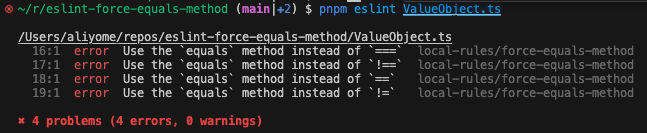

# eslint-force-equals-method

This ESLint plugin is created for learning purposes. It prohibits the use of ==, !=, ===, !== in the comparison of immutable value objects and enforces the use of the equals method.

```ts
class ValueObject {
  constructor(private readonly value: string) {}
  equals(other: ValueObject) {
    return this.value === other.value;
  }
}

const vo1 = new ValueObject('foo');
const vo2 = new ValueObject('foo');

// OK
vo1.equals(vo2);

// NG
vo1 === vo2;
vo1 !== vo2;
vo1 == vo2;
vo1 != vo2;
```


